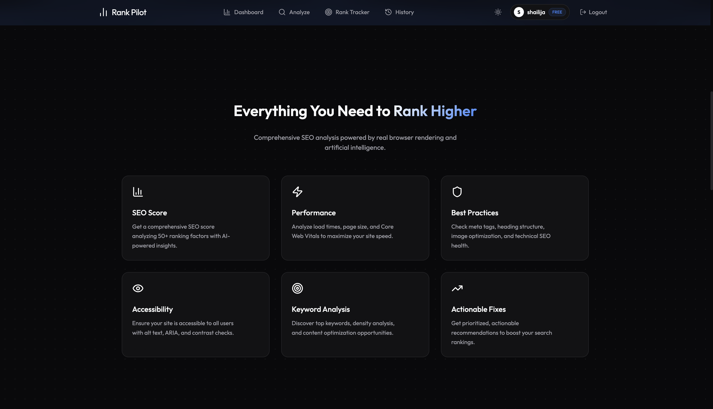
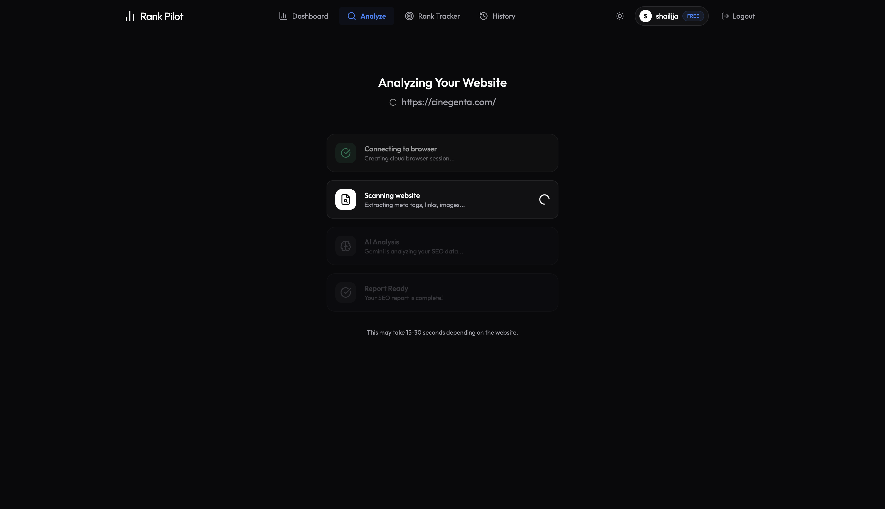
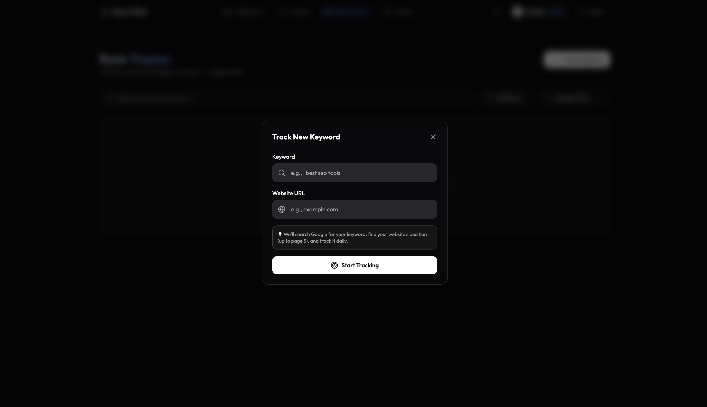

# SEO Rank Tracker

SEO Rank Tracker is a full-stack SEO dashboard that combines website auditing, AI-powered recommendations, and keyword rank tracking in one workflow.

It allows authenticated users to:
- analyze any public website for SEO, performance, accessibility, and best-practice issues
- review structured reports with scores, metadata, headings, links, images, and keywords
- monitor keyword positions over time
- view historical audits and rank tracking data
- manage a protected dashboard with login and registration


## Tech Stack

- Frontend: React, TypeScript, Vite, Tailwind CSS
- Backend: Node.js, Express.js, MongoDB, Mongoose
- AI analysis: Google Gemini
- Browser automation: Playwright + Browserbase
- Scheduling: node-cron

## Project Structure

```text
SEO-Rank-Tracker/
├── client/              # React + Vite frontend
├── server/              # Express + MongoDB backend
├── README.md            # Main project overview
├── .gitignore
└── .env.example?       # optional local env template if added later
```

## Features

### Website SEO Analysis
- Submit a URL for an SEO audit
- Get a score breakdown by category
- Review metadata, headings, images, links, and word count
- Discover structured issues with severity and recommendations
- Save historical reports by user

### Keyword Rank Tracking
- Add tracked keywords for a target domain
- Check keyword position against Google search results
- Track change over time via rank history
- Enable or disable tracking and refresh manually
- Background daily cron checks for active keywords

### User Workflow
- Register and login securely
- JWT-based session protection on API routes
- Access protected dashboard pages only after authentication
- Manage analysis and keyword history per user

## Live Demo

The application is deployed and can be accessed here:

- Live app: https://seo-rank-tracker-sand.vercel.app/

## Screenshots

<div align="center">
  <table>
    <tr>
      <td width="50%"></td>
      <td width="50%"></td>
    </tr>
    <tr>
      <td width="50%"></td>
      <td width="50%"></td>
    </tr>
  </table>
</div>

## Prerequisites

Before running the project, install:
- Node.js 18+
- npm
- MongoDB instance or MongoDB Atlas connection string
- Google Gemini API key
- Browserbase API key

## Environment Setup

### Server environment
Create a `.env` file inside the `server` folder:

```env
PORT=5000
MONGODB_URL=mongodb://127.0.0.1:27017/seo-rank-tracker
JWT_SECRET=your-super-secret-jwt-key
GEMINI_API_KEY=your_gemini_api_key
BROWSERBASE_API_KEY=your_browserbase_api_key
```

### Client environment
Create a `.env` file inside the `client` folder:

```env
VITE_BACKEND_URL=http://localhost:5000
```

## Running the Project

### 1) Install dependencies

```bash
cd client && npm install
cd ../server && npm install
```

### 2) Start the backend

```bash
cd server
npm run server
```

The backend runs with nodemon and listens on `http://localhost:5000` by default.

### 3) Start the frontend

```bash
cd client
npm run dev
```

The Vite app usually runs on `http://localhost:5173`.

## Production Build

### Client

```bash
cd client
npm run build
```

### Server

```bash
cd server
npm start
```

## Main API Areas

- `/api/auth` — registration, login, authenticated user lookup
- `/api/analysis` — create, list, fetch, delete SEO reports
- `/api/rank` — add, refresh, list, delete, toggle tracked keywords

## Notes

- The backend starts a scheduled cron job for recurring keyword checks.
- SEO analysis is done asynchronously after submission, so the report may finish in the background.
- Some SEO checks depend on external browser automation and LLM services, so API credentials must be configured correctly.

## Related Docs

- [client/README.md](client/README.md)
- [server/README.md](server/README.md)
